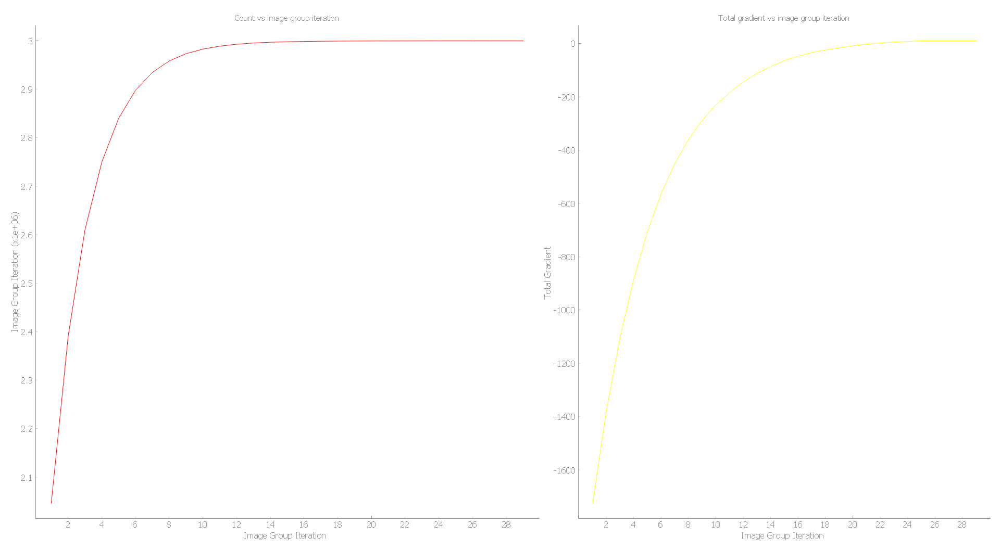

### Project description
What does the code do?

- Program is ran
- Code waits for new images to appear in the specified path
- Once a new Image is detected it's processed for its mean brightness
- The code continues, summing the individual mean of single images until we have `self.image_group` to take the total mean over the single means sum
- The code takes an initial guess for each parameter (+1 or -1)
- The code takes the partial derivatives for parameters and adds them to their respective derivative parameter history lists
- We adjust the new parameter value relying on the latest parameter derivative using gradient ascent so that $a_{n+1}=a_{n}+\gamma \frac{\partial C}{\partial p}$ Where $p$ is the parameter
- Repeat until the function $C(\phi_{2},\phi_{3},f)$ is at maximum (or at least close to it)

### Code setup
##### Camera triggering and capture
We utilize a physical pulse generator (from the master clock or photodiode) for the pulse generation to synchronize the camera triggering to the laser. 

- Open the SpinView program
- Connect camera to triggering Stanford box and computer
- Adjust region of interest and bit depth to `16 bit`
- Switch `trigger mode` to on
- Click on the record function 
- Set format to `.tiff` and recording mode to `Streaming`
- Select the directory for the code to access 

##### Install imports
The following libraries are used for the projects, ensure you have installed the necessary libraries before proceeding.

```python
import os
import cv2 # needs to be installed 
import numpy as np # needs to be installed 
from ftplib import FTP
import shutil
import random
from watchdog.events import FileSystemEventHandler # needs to be installed 
from pyqtgraph.Qt import QtCore, QtGui, QtWidgets # needs to be installed 
from pyqtgraph.Qt import QtGui # needs to be installed 
import pyqtgraph as pg # needs to be installed 
import sys
import time
from watchdog.events import FileSystemEventHandler # needs to be installed 
from watchdog.observers import Observer # needs to be installed 
```

##### Hard-coded paths
Marked by full capitalization, the code includes a number of hard coded paths, before proceeding adjust them accordingly to your setup. 

```python
# computer near chamber
MIRROR_FILE_PATH = r'dm_parameters.txt' # this is the txt file the code writes to
self.IMG_PATH = r'images' # this is the folder from which the code will process the images, make sure it aligns with the path specified in SpinView

self.ftp = FTP()
self.ftp.connect(host="192.168.200.3") # ip of deformable mirror computer
self.ftp.login(user="Utilisateur", passwd="alls") # windows user and password of deformable mirror computer
```

## Image processing 

##### X-ray Count
Since we're imaging a phosphor screen, the x-ray count is tracked using the brightness of the resulting image. The following function appluied the median blur and calculates the mean brightness per pixel of a single image.

```python 
    # method to calculate count (by its brightness proxy)   
    def calc_count_per_image(self, image_path):
        # read the image in 16 bit
        original_image = cv2.imread(image_path, cv2.IMREAD_UNCHANGED | cv2.IMREAD_ANYDEPTH)
        # apply median blur on image
        median_blured_image = cv2.medianBlur(original_image, 5)
        # calculate mean brightness of blured image
        self.single_img_mean_count = median_blured_image.mean()
        # return the count (brightness of image)
        return self.single_img_mean_count
```

`cv2.IMREAD_ANYDEPTH` ensures we are reading in the bit depth of the image, `16bit`.

## Optimization algorithm
Processing the data with vanilla gradient descent to optimize the `count` function by adjusting `second_order_dispersion`, `third_order_dispersion`, and `focus` according to the real-time count reading from the camera.

```python
    def process_images(self, new_images):
        self.initialize_image_files()
        
        new_images = [image_path for image_path in new_images if os.path.exists(image_path)]
        new_images.sort(key=os.path.getctime)
        
        # loop over all new images 
        for image_path in new_images:
            img_mean_count = self.calc_count_per_image(image_path)
            self.image_group_count_sum += np.sum(img_mean_count)

            # keep track of the times the program ran (number of images we processed)
            self.images_processed += 1

            # conditional to check if the desired numbers of images to mean was processed
            if self.images_processed % self.image_group == 0:
                # take the mean count for the number of images set
                self.mean_count_per_image_group = np.mean(img_mean_count)
                # append to count_history list to keep track of count through the optimization process
                self.count_history = np.append(self.count_history, self.mean_count_per_image_group)

                # update count for 'images_group' processed (number of image groups processed)
                self.image_groups_processed += 1
                self.iteration_data = np.append(self.iteration_data, self.image_groups_processed)

                # if we are in the first time where the algorithm needs to adjust the value
                if self.image_groups_processed == 1:
                    print('-------------')       

                    # add initial values to lists
                    self.focus_history = np.append(self.focus_history, self.initial_focus)      
                    self.second_dispersion_history = np.append(self.second_dispersion_history, self.initial_second_dispersion)                   
                    self.third_dispersion_history = np.append(self.third_dispersion_history, self.initial_third_dispersion)
                    
                    # print to help track the evolution of the system
                    print(f"initial values are: focus {self.focus_history[-1]}, second_dispersion {self.second_dispersion_history[-1]}, third_dispersion {self.third_dispersion_history[-1]}")
                    print(f"initial directions are: focus {self.random_direction[0]}, second_dispersion {self.random_direction[1]}, third_dispersion {self.random_direction[2]}")
                    
                    # call function to take random directions
                    self.initial_optimize()

                else:
                    self.image_groups_dir_run_count += 1
                    self.optimize_count()

                # write values to text files
                with open(MIRROR_FILE_PATH, 'w') as file:
                    file.write(' '.join(map(str, mirror_values)))

                with open(DISPERSION_FILE_PATH, 'w') as file:
                    file.write(f'order2 = {dispersion_values[0]}\n')
                    file.write(f'order3 = {dispersion_values[1]}\n')

                QtCore.QCoreApplication.processEvents()

                # print the latest mean count (helps track system)
                print(f"Mean count for last {self.image_group} images: {self.count_history[-1]:.2f}")

                # print the current parameter values which resulted in the brightness above
                print(f"Current values are: focus {self.focus_history[-1]}, second_dispersion {self.second_dispersion_history[-1]}, third_dispersion {self.third_dispersion_history[-1]}")
                
                # after the algorithm adjusted the value and wrote it to the txt, send new txt to deformable mirror computer
                # self.upload_files()
                
                # update the plots
                self.plot_curve.setData(self.iteration_data, self.count_history)
                self.total_gradient_curve.setData(self.der_iteration_data, self.total_gradient_history)

                # reset variables for next optimization round
                self.image_group_count_sum = 0
                self.mean_count_per_image_group  = 0
                img_mean_count = 0  
                print('-------------')
```


##### Initial optimization
```python
def initial_optimize(self):
	# take initial guesses for each variable 
	self.new_focus = self.focus_history[-1] + self.random_direction[0]
	self.new_second_dispersion = self.second_dispersion_history[-1] + self.random_direction[1]
	self.new_third_dispersion = self.third_dispersion_history[-1] + self.random_direction[2]

	# bind to bounds and round to round to integer
	self.new_focus = round(np.clip(self.new_focus, self.FOCUS_LOWER_BOUND, self.FOCUS_UPPER_BOUND))
	self.new_second_dispersion = round(np.clip(self.new_second_dispersion, self.SECOND_DISPERSION_LOWER_BOUND, self.SECOND_DISPERSION_UPPER_BOUND))
	self.new_third_dispersion = round(np.clip(self.new_third_dispersion, self.THIRD_DISPERSION_LOWER_BOUND, self.THIRD_DISPERSION_UPPER_BOUND))

	# add to lists
	self.focus_history.append(self.new_focus)
	self.second_dispersion_history.append(self.new_second_dispersion)
	self.third_dispersion_history.append(self.new_third_dispersion)

	# update in file
	mirror_values[0] = (self.focus_history[-1])
	dispersion_values[0] = (self.second_dispersion_history[-1])
	dispersion_values[1] = (self.third_dispersion_history[-1])
```

##### Main optimization
The main optimization uses the gradient descent algorithm to adjust the variables and lead to peak count. After we've reached a sufficient point (either small change in count or repetition in all three parameters) we stop the optimization algorithm.

```python
    def calc_derivatives(self):
        
        # take derivative for every parameter
        self.count_focus_der = (self.count_history[-1] - self.count_history[-2]) / (self.focus_history[-1] - self.focus_history[-2])
        self.count_second_dispersion_der = (self.count_history[-1] - self.count_history[-2]) / (self.second_dispersion_history[-1] - self.second_dispersion_history[-2])
        self.count_third_dispersion_der = (self.count_history[-1] - self.count_history[-2]) / (self.third_dispersion_history[-1] - self.third_dispersion_history[-2])

        # add the derivatives to according history lists for plotting
        self.focus_der_history = np.append(self.focus_der_history, [self.count_focus_der])
        self.second_dispersion_der_history = np.append(self.second_dispersion_der_history, [self.count_second_dispersion_der])
        self.third_dispersion_der_history = np.append(self.third_dispersion_der_history, [self.count_third_dispersion_der])

        # add all derivatives for different parameters
        self.total_gradient = (self.focus_der_history[-1] + self.second_dispersion_der_history[-1] + self.third_dispersion_der_history[-1])

        # add to respective lists for plotting and tracking
        self.total_gradient_history = np.append(self.total_gradient_history, self.total_gradient)
        self.der_iteration_data = np.append(self.der_iteration_data, self.image_groups_dir_run_count)

        # return dicts with derivatives
        return {
            "focus":self.count_focus_der,
            "second_dispersion":self.count_second_dispersion_der,
            "third_dispersion":self.count_third_dispersion_der
            }
```

```python
    # main optimization block for gradient descent 
    def optimize_count(self):
        
        # get count derivatives for parameters
        derivatives = self.calc_derivatives()
        
        if np.abs(self.focus_learning_rate * derivatives["focus"]) > 1:
            self.new_focus = self.focus_history[-1] + self.focus_learning_rate * self.focus_der_history[-1]
            self.new_focus = np.clip(self.new_focus, self.FOCUS_LOWER_BOUND, self.FOCUS_UPPER_BOUND)
            self.new_focus = int(round(self.new_focus))

            self.focus_history = np.append(self.focus_history, self.new_focus)
            mirror_values[0] = self.new_focus

        if np.abs(self.second_dispersion_learning_rate * derivatives["second_dispersion"]) > 1:
            self.new_second_dispersion = self.second_dispersion_history[-1] + self.second_dispersion_learning_rate * self.second_dispersion_der_history[-1]
            self.new_second_dispersion = np.clip(self.new_second_dispersion, self.SECOND_DISPERSION_LOWER_BOUND, self.SECOND_DISPERSION_UPPER_BOUND)
            self.new_second_dispersion = int(round(self.new_second_dispersion))

            self.second_dispersion_history = np.append(self.second_dispersion_history, self.new_second_dispersion)
            dispersion_values[0] = self.new_second_dispersion

        if np.abs(self.third_dispersion_learning_rate * derivatives["third_dispersion"]) > 1:
            self.new_third_dispersion = self.third_dispersion_history[-1] + self.third_dispersion_learning_rate * self.third_dispersion_der_history[-1]
            self.new_third_dispersion = np.clip(self.new_third_dispersion, self.THIRD_DISPERSION_LOWER_BOUND, self.THIRD_DISPERSION_UPPER_BOUND)
            self.new_third_dispersion = int(round(self.new_third_dispersion))

            self.third_dispersion_history = np.append(self.third_dispersion_history, self.new_third_dispersion)
            dispersion_values[1] = self.new_third_dispersion
        
        # if the change in all variables is less than one (we can not take smaller steps thus this is the optimization boundry)
        if (
            np.abs(self.third_dispersion_learning_rate * derivatives["third_dispersion"]) < 1 and
            np.abs(self.second_dispersion_learning_rate * derivatives["second_dispersion"]) < 1 and
            np.abs(self.focus_learning_rate * derivatives["focus"]) < 1
        ):
            print("Convergence achieved")
            
        # stop optimizing parameter if we reached optimization resolution limit
        
        elif np.abs(self.third_dispersion_learning_rate * derivatives["third_dispersion"]) < 1:
            print("Convergence achieved in third dispersion")
        
        elif np.abs(self.second_dispersion_learning_rate * derivatives["second_dispersion"]) < 1:
            print("Convergence achieved in second dispersion")
            
        elif np.abs(self.focus_learning_rate * derivatives["focus"]) < 1:
            print("Convergence achieved in focus")
        
        if self.image_groups_processed >2:
            # if the count is not changing much this means that we are near the peak 
            if np.abs(self.count_history[-1] - self.count_history[-2]) <= self.count_change_tolerance:
                print("Convergence achieved")
```

## Communication
After the algorithm has decided on the values, we send the data (in '.txt` format) to the deformable mirror computer, and Dazzler computer using FTP. 
##### Writing values to Dazzler
- Setup FTP connection (computer connected to network)
- Seed `request.txt` in `D:\GZ0483-HR-670-930p`
- `request.txt` will read from `dispersion.txt` located in the server path `C:\Users\fastlite\Desktop\commands`
##### Sending command
After processing the data through the algorithm, we send a command txt file to the mirror computer. In order to test the connection between the computers open `cmd` and `ping` the computers.

```python
    # method used to send the new values to the mirror and dazzler computers via FTP
    def upload_files(self):
 
        mirror_files = [os.path.basename(MIRROR_FILE_PATH)]
        dazzler_files = [os.path.basename(DISPERSION_FILE_PATH)]

        # try to send the file via ftp connection
        try:

            for mirror_file_name in mirror_files:
                for dazzler_file_name in dazzler_files:
                    focus_file_path = MIRROR_FILE_PATH
                    dispersion_file_path = DISPERSION_FILE_PATH

                    if os.path.isfile(focus_file_path) and os.path.isfile(dispersion_file_path):
                        copy_mirror_IMG_PATH = os.path.join('mirror_command', f'copy_{mirror_file_name}')
                        copy_dazzler_IMG_PATH = os.path.join('dazzler_command', f'copy_{dazzler_file_name}')

                        try:
                            os.makedirs(os.path.dirname(copy_mirror_IMG_PATH))
                            os.makedirs(os.path.dirname(copy_dazzler_IMG_PATH))
                        except OSError:
                            pass

                        shutil.copy(focus_file_path, copy_mirror_IMG_PATH)
                        shutil.copy(dispersion_file_path, copy_dazzler_IMG_PATH)

                        with open(copy_mirror_IMG_PATH, 'rb') as local_file:
                            self.mirror_ftp.storbinary(f'STOR {mirror_file_name}', local_file)
                            print(f"Uploaded to mirror FTP: {mirror_file_name}")

                        with open(copy_dazzler_IMG_PATH, 'rb') as local_file:
                            self.dazzler_ftp.storbinary(f'STOR {dazzler_file_name}', local_file)
                            print(f"Uploaded to dazzler FTP: {dazzler_file_name}")

                        os.remove(copy_mirror_IMG_PATH)
                        os.remove(copy_dazzler_IMG_PATH)

        except Exception as e:
            print(f"Error in FTP upload: {e}")
```

### Gradient Descent Optimization Test
This is a test for the gradient descent algorithm relying on a definition of an arbitrary function to verify the code correctly finds the maximum. Let's start with testing the code on a convex function, and proceed to test it on more complex functions with local maxima. 

#### Convex parabolic function
For the purpose of testing the `count` was was simulated by the function - no images were processed.

$$C(\phi_{2},\phi_{3},f)=-1 \cdot ((\phi_{2}-42)^2 + (\phi_{3}-70)^2 + (f+972)^{2}+3^6)$$
$$\text{Algorithm should arrive at:} \; \phi_{2}=42,\; \phi_{3}=70,\; f=-972$$

in the code this is expressed by the `count_function`:

```python
    def count_function(self, new_focus, new_second_dispersion, new_third_dispersion):
        count_func = -1*(((new_second_dispersion - 42) ** 2) + ((new_third_dispersion - 70) ** 2) + ((new_focus + 972) ** 2)) +3e6
        return count_func
```

where the partial derivatives are calculated:

```python
    def calc_derivatives(self):
        self.count_focus_der = -2*(self.new_focus+972)
        self.count_second_dispersion_der = -2*(self.new_second_dispersion-42)
        self.count_third_dispersion_der = -2*(self.new_third_dispersion-69)
        self.focus_der_history.append(self.count_focus_der)      self.second_dispersion_der_history.append(self.count_second_dispersion_der)
     self.third_dispersion_der_history.append(self.count_third_dispersion_der)
        self.total_gradient = (self.focus_der_history[-1] + self.second_dispersion_der_history[-1] + self.third_dispersion_der_history[-1])
        self.total_gradient_history.append(self.total_gradient)
        self.der_iteration_data.append(self.dir_run_count)
        return {"focus":self.count_focus_der,"second_dispersion":self.count_second_dispersion_der,"third_dispersion":self.count_third_dispersion_der}
```

After running the code the console suggests:
```
initial directions are: focus -1, second_dispersion -1, third_dispersion -1
-------------
convergence achieved
function_value 2053973.0, current values are: focus -197, second_dispersion 6, third_dispersion 13
-------------       
convergence achieved
function_value 2394830.0, current values are: focus -352, second_dispersion 13, third_dispersion 24
-------------       
convergence achieved
function_value 2612643.0, current values are: focus -476, second_dispersion 19, third_dispersion 33
-------------       
convergence achieved
function_value 2752086.0, current values are: focus -575, second_dispersion 24, third_dispersion 40
-------------
convergence achieved
function_value 2982964.0, current values are: focus -868, second_dispersion 37, third_dispersion 62

* * *

-------------
function_value 2999914.0, current values are: focus -967, second_dispersion 37, third_dispersion 64
```

The according plots are as such:
<br>
<div align="center">

</div>
The final line shows we approached `focus -967, second_dispersion 37, third_dispersion 64`. This is due to rounding errors, resulting in the optimized values not being exact, but we get very close.
